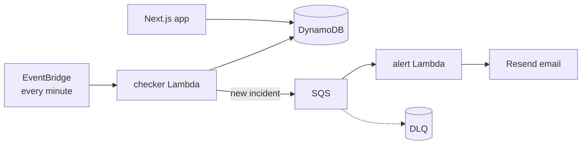

# uptime-service

A small uptime monitor I built to get hands-on with event-driven AWS. You add
a URL, it gets checked every minute from Sydney, and you get an email when the
site goes down. Every monitor also gets a public status page you can share.

Demo: _coming soon_ · Stack: Next.js, TypeScript, DynamoDB, Lambda, SQS,
EventBridge, CDK, Clerk, Resend

## How it works

EventBridge triggers the checker Lambda once a minute. It loads the active
monitors from DynamoDB, fetches each URL with a 10 second timeout, and writes
a check result. When a site transitions from up to down it opens an incident
and pushes a message onto SQS. The alert Lambda consumes that queue and sends
the email through Resend. Sends that keep failing get retried and eventually
land in a dead letter queue rather than disappearing.



The web app is Next.js (App Router) with Clerk for auth. Pages that read data
are server components talking straight to DynamoDB; creating, pausing and
deleting monitors goes through API routes validated with Zod. The public
status page is cached for 60 seconds since checks only arrive once a minute
anyway.

Alerts only fire on the up-to-down edge, so one outage means one email, not
one per minute until it recovers.

## Data model

Everything lives in one DynamoDB table:

| Entity      | PK              | SK                          |
| ----------- | --------------- | --------------------------- |
| Monitor     | `USER#<userId>` | `MONITOR#<monitorId>`       |
| CheckResult | `MONITOR#<id>`  | `CHECK#<isoTime>`           |
| Incident    | `MONITOR#<id>`  | `INCIDENT#OPEN` or `INCIDENT#<startedAt>#<id>` |

Two indexes on top of that: GSI1 is a sparse index that only contains active
monitors (the checker queries it instead of scanning the table), and GSI2
lets the public status page look a monitor up by id alone.

A couple of details I'm happy with: the open incident sits at a fixed sort
key and is claimed with a conditional write, so two overlapping checker runs
can't both open one. The 5-monitor limit is enforced by a counter item in the
same transaction as the create, so concurrent requests can't sneak past it.
Check results carry a 30 day TTL so the table doesn't grow forever.

Monitor URLs have to be public https. Localhost, private ranges and the cloud
metadata address are rejected at create time, and the checker re-resolves the
hostname before every probe in case DNS changed since (rebinding).

## Running it locally

You'll need Node 22+, an AWS account, and free accounts with Clerk and Resend.

```bash
npm ci
cp .env.example .env.local   # then fill it in
npm run dev
```

Tests and checks:

```bash
npm test            # unit tests + CDK template assertions
npm run typecheck
npm run lint
```

## Deploying

Infra first (one-time `npx cdk bootstrap` for the account, then):

```bash
npm run deploy
```

The deploy reads Resend settings from `.env.local` and prints the table name
when it finishes. Put that in your Vercel project env along with the Clerk
and AWS keys, and deploy the frontend from the Vercel dashboard.

I'd also set a $10 AWS budget alert before leaving it running. Everything is
on-demand or free tier so it should cost close to nothing, but belt and
braces.

## Env vars

See `.env.example`. Short version: Clerk keys for auth, AWS credentials plus
`TABLE_NAME` for the web app, and `RESEND_API_KEY` / `ALERT_FROM_EMAIL` /
`ALERT_FALLBACK_EMAIL` which get baked into the alert Lambda at deploy time.

## Decisions

I kept a running log of what I built at each step and why in
[DECISIONS.md](DECISIONS.md), including a hardening pass at the end where I
reviewed the whole thing and fixed a validation bug, two race conditions and
an alerting config bug before deploying.

## Known limitations

- Checks run from one region. A network blip between Sydney and the target
  looks the same as real downtime. Multi-region checking with quorum is the
  obvious next step.
- Email is the only alert channel right now.
- No SSL expiry or content checks yet.
