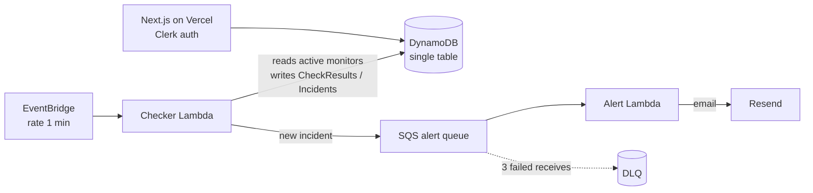

# Uptime

A serverless uptime-monitoring service. Add a URL, get checked every minute
from Sydney, receive an email the moment it goes down, and share a public
status page for it.

## Architecture



- **Checker Lambda** (EventBridge, every minute): lists active monitors via a
  sparse GSI, probes each URL concurrently with a 10s timeout (2xx/3xx = up,
  redirects not followed), writes a `CheckResult`, and opens/closes an
  `Incident` when the up/down state changes.
- **Alert Lambda** (SQS consumer): one email per *new* incident via Resend.
  Partial batch failures retry only what failed; poison messages land in a DLQ.
- **Next.js app** (Vercel): Clerk-authenticated dashboard (list, add form,
  response-time chart, incident history) plus a public, read-only
  `/status/<id>` page.

### Data model (DynamoDB single table)

| Entity      | PK                  | SK                    |
| ----------- | ------------------- | --------------------- |
| Monitor     | `USER#<userId>`     | `MONITOR#<monitorId>` |
| CheckResult | `MONITOR#<id>`      | `CHECK#<isoTime>`     |
| Incident    | `MONITOR#<id>`      | `INCIDENT#<uuid>`     |

Two GSIs: `GSI1` — sparse index of active monitors (checker's work list,
no table scan); `GSI2` — monitor lookup by id alone (public status page).

## Local setup

Requires Node 22+ and an AWS account (ap-southeast-2).

```bash
npm ci
cp .env.example .env.local   # fill in the values below
npm run dev                  # Next.js on http://localhost:3000
npm test                     # unit + CDK assertion tests
npm run typecheck
```

### Environment variables

| Variable | Purpose |
| --- | --- |
| `NEXT_PUBLIC_CLERK_PUBLISHABLE_KEY` / `CLERK_SECRET_KEY` | Clerk auth ([dashboard](https://dashboard.clerk.com)) |
| `NEXT_PUBLIC_CLERK_SIGN_IN_URL` | `/sign-in` |
| `AWS_REGION` / `AWS_ACCESS_KEY_ID` / `AWS_SECRET_ACCESS_KEY` | DynamoDB access for the web app |
| `TABLE_NAME` | Output of `npm run deploy` |
| `RESEND_API_KEY` | Resend API key (read at deploy time) |
| `ALERT_FROM_EMAIL` | Verified Resend sender |
| `ALERT_FALLBACK_EMAIL` | Recipient when a monitor has no alert email |

## Deploy

1. **Infra** — `npx cdk bootstrap` once for the account/region, then:
   ```bash
   RESEND_API_KEY=... ALERT_FROM_EMAIL=... ALERT_FALLBACK_EMAIL=... npm run deploy
   ```
   Copy the `TableName` output into your web env.
2. **Web** — import the repo in [Vercel](https://vercel.com), set the env vars
   above, deploy.
3. **Billing guard** — create a $10/month AWS budget alert (Console → Billing →
   Budgets) before leaving the stack running.

## Tech choices, briefly

- **Single-table DynamoDB**: every access pattern is one query; on-demand
  billing fits a 1-req/min workload.
- **CDK** over raw CloudFormation/console: infra reviewed in PRs and asserted
  in unit tests.
- **SQS between checker and alerting**: decouples probing from email delivery;
  retries + DLQ come for free.
- **Zod at every boundary**: API input, SQS message contract, and the
  add-monitor form reuse the same schemas.
- **SSRF-aware validation**: monitor URLs must be public https — localhost,
  private ranges and the cloud metadata address are rejected, and the checker
  doesn't follow redirects.

See [DECISIONS.md](DECISIONS.md) for the step-by-step build log.
